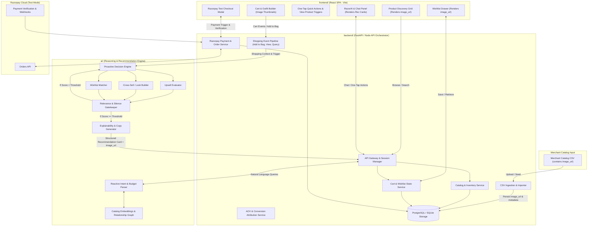

# Razorpay AI Revenue Growth Agent: Phase-Wise Architecture

## 1. Executive Summary & Problem Framing

Merchants with large catalogs often suffer from sub-optimal Average Order Value (AOV) because traditional e-commerce search and category grids leave the burden of product discovery entirely on the buyer. Customers frequently purchase a single isolated item without discovering superior alternatives, complementary accessories, or items they had previously saved in their wishlist.

The **Razorpay AI Revenue Growth Agent** is an autonomous, context-aware co-pilot embedded within a merchant's digital storefront. It leverages **Razorpay Test-Mode APIs** alongside a hybrid **Reactive & Proactive AI reasoning engine** to drive merchant revenue through three pillars:
1. **Upselling**: Intelligently proposing superior upgrades within acceptable price deltas and explained value (e.g., wrinkle-resistant fabric, structured fit, premium craftsmanship).
2. **Cross-Selling**: Progressively assembling coherent bundles / complete looks based dynamically on the customer's active choices and intent (e.g., Topwear &rarr; Bottomwear &rarr; Footwear &rarr; Accessories).
3. **Wishlist Conversion**: Resurfacing previously saved items when they contextually match the customer's active shopping basket and intent.

### Non-Negotiable Operating Principles
- **Dynamic AI Reasoning (No Hardcoded Flows)**: The AI dynamically interprets user choices, style preferences, categories, budgets, and occasions. Recommendations are generated contextually based on whatever clothing or items the user selects—not constrained by hardcoded scripts or fixed occasion templates.
- **Visual Richness & External Image URL Pipeline**: Product images are supplied directly by merchants via catalog CSV inputs and served via standard HTTP/HTTPS image URLs. Product images are NOT stored locally inside `frontend/public/images/`.
- **Explainability**: Every recommendation includes a clear, customer-centric rationale ("Why this?").
- **Financial & Budget Guardrails**: Hard ceilings on customer budget; no automated billing—every financial action requires explicit customer approval before Razorpay checkout initiation.
- **Respectful Proactivity ("The Power of Doing Nothing")**: The agent evaluates relevance score and confidence threshold; if no high-value recommendation exists, it remains completely silent to prevent customer fatigue.

---

## 2. High-Level System Architecture & Product Image Flow

### 2.1 Product Image Architecture Flow

Product images follow a strict, decoupled single-source-of-truth pipeline:

```
CSV (Merchant Input) ──► Database (Canonical Storage) ──► JSON API (API Communication) ──► Frontend / AI
```

- **CSV = Merchant Input**: The merchant catalog is supplied as a CSV file containing an `image_url` field (and optional additional image URLs).
- **Database = Canonical Storage**: The backend ingestion service imports the merchant CSV and stores `image_url` alongside product metadata in the relational database.
- **JSON = API Communication**: The backend REST/GraphQL API returns `image_url` in all JSON payload responses.
- **Frontend & AI Consumption**: Storefront product cards, AI recommendation drawer cards, wishlist items, slide-over cart, and checkout modals consume this exact `image_url` string. Product images are NEVER stored in `frontend/public/images/`.

### 2.2 System Component Diagram



---

## 3. Directory Structure & Separation of Concerns

The workspace is organized into core directories with strict separation of concerns. Notice that product images are **not** stored inside `frontend/public/images/`.

```
RazorpayAI/
├── .gitignore                    # Master ignore rules for Python, Node, env, build artifacts
├── docs/                         # Architecture, problem statement, API schemas
│   ├── problemStatement.md       # Original contest problem statement
│   └── phase_wise_architecture.md# Dynamic architectural specification
│
├── backend/                      # Backend Orchestrator & Business Logic
│   ├── README.md
│   ├── app/
│   │   ├── api/                  # REST/WebSocket endpoints
│   │   │   ├── routes_catalog.py
│   │   │   ├── routes_cart.py
│   │   │   ├── routes_agent.py
│   │   │   └── routes_checkout.py
│   │   ├── core/                 # App configuration, security, database sessions
│   │   ├── models/               # Database ORM models (Product with image_url, Cart, Order)
│   │   ├── schemas/              # Pydantic / DTO validation schemas
│   │   ├── db/
│   │   │   ├── csv_importer.py   # Ingests merchant CSV catalog with image_url column
│   │   │   └── seed_data.csv     # Merchant catalog CSV dataset
│   │   └── services/             # Razorpay client, Cart logic, Event dispatcher
│   ├── tests/                    # Backend unit and integration tests
│   └── requirements.txt / package.json
│
├── frontend/                     # React Storefront SPA (Vite)
│   ├── index.html                # Single Page Application entrypoint
│   ├── vite.config.js            # Vite build & dev server configuration
│   ├── package.json              # React 19, Axios, Vite dependencies
│   ├── public/                   # Static public assets (No static product images)
│   └── src/                      # React Application source
│       ├── main.jsx              # React DOM mounting entrypoint
│       ├── App.jsx               # Root application layout & state orchestration
│       ├── index.css             # Global dark theme tokens & component styling
│       ├── components/
│       │   ├── layout/           # Header navbar & Hero banner components
│       │   ├── catalog/          # ProductCard, ProductGrid, Filters components
│       │   ├── chat/             # ChatDrawer AI Sales Co-Pilot component
│       │   ├── recommendations/  # Upsell & Cross-sell look builder cards
│       │   └── checkout/         # Razorpay payment checkout components
│       └── services/
│           └── api.js            # Shared Axios API instance & endpoint methods
│
└── ai/                           # AI Models, Embeddings, Prompts & Decision Logic
    ├── README.md
    ├── catalog_indexer/          # Catalog enrichment, auto-tagging, vector/graph generation
    ├── agents/
    │   ├── reactive_agent.py     # Conversational search returning image_url & details
    │   ├── proactive_agent.py    # Add-to-bag trigger evaluator & rule orchestration
    │   └── decision_engine.py    # Upsell vs Cross-sell vs Wishlist prioritization
    ├── prompts/                  # System prompts, few-shot templates, explainability guardrails
    ├── vector_store/             # ChromaDB / FAISS or Vector index handler
    ├── utils/                    # Budget parser, attribute extractor, ranking metrics
    └── tests/                    # AI unit tests and evaluation suite
```

---

## 4. Detailed Data Models & Schema Design

### 4.1 Product & Relationship Graph Model
```json
{
  "product_id": "prod_101",
  "title": "Classic Oxford Shirt",
  "description": "100% breathable cotton, slim fit, versatile styling.",
  "category": "Apparel",
  "subcategory": "Shirts",
  "price": 399,
  "currency": "INR",
  "image_url": "https://images.unsplash.com/photo-1596755094514-f87e34085b2c?w=600&auto=format&fit=crop&q=80",
  "image_urls": [
    "https://images.unsplash.com/photo-1596755094514-f87e34085b2c?w=600&auto=format&fit=crop&q=80",
    "https://images.unsplash.com/photo-1602810318383-e386cc2a3ccf?w=600&auto=format&fit=crop&q=80"
  ],
  "attributes": {
    "color": "White",
    "fabric": "Cotton",
    "fit": "Slim",
    "style": "Smart Casual",
    "occasions": ["Daily Wear", "Office", "Events"]
  },
  "upgrades": [
    {
      "target_product_id": "prod_102",
      "delta_price": 100,
      "upgrade_axis": ["Fabric", "Durability"],
      "pitch": "Wrinkle-resistant luxury weave with structured collar"
    }
  ],
  "complements": [
    {
      "target_product_id": "prod_201",
      "relation_type": "pairs_with",
      "slot": "Trousers",
      "pitch": "Navy tailored trousers complement your selected shirt perfectly"
    },
    {
      "target_product_id": "prod_301",
      "relation_type": "accessory",
      "slot": "Footwear",
      "pitch": "Leather shoes styled to complete your outfit"
    }
  ]
}
```

### 4.2 Shopping Context & Active Session
```json
{
  "session_id": "sess_abc123",
  "customer_profile": {
    "explicit_budget": 2500,
    "current_intent": "Dynamic Customer Goal (e.g., Casual Weekend, Office Formal, Party Look)",
    "preferred_styles": ["Minimalist", "Modern"]
  },
  "cart": {
    "items": [
      {
        "product_id": "prod_101",
        "title": "Classic Oxford Shirt",
        "quantity": 1,
        "price": 399,
        "image_url": "https://images.unsplash.com/photo-1596755094514-f87e34085b2c?w=600&auto=format&fit=crop&q=80"
      }
    ],
    "subtotal": 399,
    "completed_slots": ["Topwear"],
    "missing_slots": ["Bottomwear", "Footwear"]
  },
  "wishlist": [
    {
      "product_id": "prod_201",
      "title": "Navy Tailored Trousers",
      "price": 899,
      "image_url": "https://images.unsplash.com/photo-1624378439575-d8705ad7ae80?w=600&auto=format&fit=crop&q=80",
      "added_at": "2026-08-15T10:00:00Z"
    }
  ],
  "interaction_history": [
    { "action": "search", "query": "cotton shirt under 499" },
    { "action": "add_to_bag", "product_id": "prod_101" }
  ]
}
```

### 4.3 Recommendation & Explanation Contract
```json
{
  "recommendation_id": "rec_9921",
  "type": "UPSELL" | "CROSS_SELL" | "WISHLIST_RECOVERY" | "SILENT",
  "confidence_score": 0.92,
  "product": {
    "product_id": "prod_102",
    "title": "Premium Wrinkle-Free Oxford Shirt",
    "price": 499,
    "image_url": "https://images.unsplash.com/photo-1602810318383-e386cc2a3ccf?w=600&auto=format&fit=crop&q=80",
    "attributes": {
      "fabric": "Wrinkle-Resistant Cotton",
      "fit": "Structured Slim"
    }
  },
  "explanation": {
    "headline": "✨ Better version found",
    "rationale": "For ₹100 more, this shirt offers wrinkle-resistant fabric and a more structured fit, ideal for your chosen style.",
    "delta_price_label": "+₹100"
  },
  "quick_actions": [
    {
      "id": "view_product",
      "label": "View Product",
      "action_type": "HIGHLIGHT_PRODUCT_IN_GRID",
      "payload": { "product_id": "prod_102" }
    },
    {
      "id": "accept_upsell",
      "label": "Yes, upgrade",
      "action_type": "SWAP_CART_ITEM",
      "payload": { "remove_id": "prod_101", "add_id": "prod_102" }
    },
    {
      "id": "reject_upsell",
      "label": "No, keep this",
      "action_type": "DISMISS"
    },
    {
      "id": "add_to_outfit",
      "label": "Add to outfit",
      "action_type": "ADD_TO_CART",
      "payload": { "product_id": "prod_102" }
    }
  ]
}
```

---

## 5. Core AI Reasoning & Decision Loop

```
Customer Shopping Action (e.g. Add to Bag: prod_101)
               │
               ▼
   [Ingest Event & Dynamically Update Session Context]
   - Current Cart: [prod_101 (Shirt - ₹399, with image_url)]
   - Active Goal: Dynamically Inferred from User Selections / Query
   - Explicit/Inferred Budget: User Budget Ceiling
   - Missing Complementary Slots: [Bottomwear, Footwear]
   - Wishlist: [prod_201 (Navy Trousers - ₹899, with image_url)]
               │
               ▼
      [Step 1: Check Upsell]
   Is there a strictly better version of prod_101?
   - Candidate: prod_102 (₹499, +₹100, image_url: https://images.unsplash.com/...)
   - Within Budget: Yes (399 + 100 <= Budget)
   - Upsell already rejected this session? No
   - Candidate Confidence >= 0.80? YES
               │
      ┌────────┴────────┐
      ▼                 ▼
   [YES]               [NO]
Suggest Upsell Card!    │
- Render Product Image  ▼
- Price & +₹100 Delta [Step 2: Check Cross-sell / Dynamic Look Completion]
- Reason & View Product Are there missing items to fulfill customer's chosen style/look?
- One-Tap Quick Actions - Missing: Bottomwear
                        - Candidate: prod_201 / prod_202 (with image_url)
                                │
                        ┌───────┴───────┐
                        ▼               ▼
                     [YES]             [NO]
             [Step 3: Check Wishlist]  Search Catalog Complements
             Is relevant item in       (Confidence >= 0.75?)
             wishlist matching user           │
             chosen clothing style?      ┌─────┴─────┐
                        │               ▼           ▼
                 ┌──────┴──────┐      [YES]        [NO]
                 ▼             ▼     Suggest     [Do Nothing]
               [YES]          [NO]   Cross-sell   Stay Silent
             Recover        Suggest  Card with
             Wishlist       Catalog  Product
             Card with      Complement Image
             Image & Rationale
```

---

## 6. Phase-Wise Execution Plan

The project will be delivered sequentially across **6 distinct phases**. Each phase is fully decoupled, testable, and strictly saves its artifacts into `backend/`, `frontend/`, or `ai/`.

```mermaid
gantt
    title Implementation Phases
    dateFormat  X
    axisFormat Phase %d
    section Development
    Phase 1 : CSV Ingestion & DB Catalog Storage (image_url)    : 0, 1
    Phase 2 : Reactive AI & Semantic Discovery (JSON API image_url): 1, 2
    Phase 3 : Proactive Sales Agent (Visual Recommendation Cards): 2, 3
    Phase 4 : Cart Builder & Razorpay Checkout (Image Basket)   : 3, 4
    section Polishing & Ops
    Phase 5 : Merchant Dashboard & AOV Attribution              : 4, 5
    Phase 6 : Security, Guardrails & Image Fallback Handling    : 5, 6
```



---

### Phase 1: Foundation, Catalog Ingestion & Database Indexing
**Primary Focus**: Merchant catalog CSV ingestion, database storage of `image_url`, establishing relationship graphs, and building the vector search index.

- **CSV Catalog Ingestion Pipeline**:
  - Merchant catalog is provided as a CSV file containing an `image_url` field per product (and optional `image_urls` for multi-image products).
  - The backend CSV importer parses the CSV, validates column schema, and stores `image_url` directly in the database alongside title, price, category, and attributes.
  - Product images are NOT saved in `frontend/public/images/`.
- **`ai/catalog_indexer/`**:
  - `enricher.py`: LLM-based catalog enricher processing merchant CSV data, deriving quality tiers, style tags, and validating external image URLs.
  - `graph_builder.py`: Computes pairwise relationships dynamically:
    - *Upgrade links* (same category, superior attribute, price delta ratio).
    - *Complementary links* (e.g., Topwear &harr; Bottomwear &harr; Footwear &harr; Accessories).
  - `vector_indexer.py`: Generates vector embeddings for semantic, multi-attribute catalog retrieval.
- **`backend/`**:
  - `csv_importer.py`: Parses merchant CSV file and populates the database (`Product`, `Category`, `ProductRelation`).
  - Database schema definition using SQLite/PostgreSQL (`Product` table with `image_url` text column).
  - REST endpoints: `GET /api/catalog/products` (returns JSON DTO with `image_url`), `GET /api/catalog/products/{id}`, `GET /api/catalog/categories`.
- **`frontend/`**:
  - Storefront layout with header, multi-filter navigation, category chips, and responsive product grid.
  - Product Card component rendering external product images directly from `image_url` returned by the JSON API.

---

### Phase 2: Reactive AI Assistant & Semantic Product Discovery
**Primary Focus**: Handling customer-initiated requests, custom style queries, budget constraints, multi-turn clarification, and dynamic grid updates with visual product cards.

- **JSON API Image Response**:
  - When the reactive agent searches or recommends products, the backend API response returns `product_id`, `title`, `price`, `image_url`, and relevant attributes.
  - The center discovery grid renders the product image directly from `image_url`.
  - AI recommendations displayed inside the chat drawer render visual product cards containing the product image loaded from `image_url`.
- **`ai/agents/reactive_agent.py`**:
  - Intent parser extracting user-specified categories, styles, colors, occasions, and price limits dynamically from free-form user prompt.
  - Dynamic outfit/look builder intent extractor.
  - Conversational memory answering product comparison questions based on user selections.
- **`backend/`**:
  - `POST /api/agent/chat`: Ingests conversation history, invokes reactive agent, returns conversational reply and matched products with `image_url`.
  - Session state tracking for current user query parameters and active filters.
- **`frontend/`**:
  - Collapsible/Floating AI Sales Agent Drawer.
  - Interactive message bubbles with embedded visual mini product cards (rendering image from `image_url`, title, price).
  - Seamless sync: AI recommendations in chat update or highlight items in the main product discovery grid.

---

### Phase 3: Proactive Sales Agent (Upselling, Cross-Selling, Wishlist Recovery)
**Primary Focus**: Autonomous event-triggered sales assistance delivering rich, explainable recommendation cards with product images and interactive "View Product" triggers.

- **Visual Recommendation Contract**:
  - For every `UPSELL`, `CROSS_SELL`, or `WISHLIST_RECOVERY` recommendation, the recommendation contract returns the product `image_url`.
  - The AI chat recommendation card displays:
    1. **Product image** (rendered from `image_url`)
    2. **Product name**
    3. **Price**
    4. **Price difference ($\Delta\text{Price}$)** for upsells, when applicable (e.g., `+₹100`)
    5. **Short explanation / reason** ("Why this recommendation?")
    6. **View Product** button/link
    7. **Relevant one-tap action** such as `Yes, upgrade`, `No, keep this`, or `Add to outfit`
- **View Product Interaction Flow**:
  - When the customer clicks **View Product**, the frontend opens/highlights that exact product in the center discovery area while keeping the AI agent panel open.
- **`ai/agents/proactive_agent.py` & `ai/agents/decision_engine.py`**:
  - Event listener evaluating `ShoppingContext` on `item_added_to_bag`.
  - **Upsell Evaluator**: Finds upgrade candidates matching the selected item's style with superior attributes, price delta, and `image_url`.
  - **Cross-Sell Evaluator**: Identifies complementary pieces matching the customer's selected clothes to complete a look.
  - **Wishlist Recovery Evaluator**: Scans customer's saved wishlist for items matching current selections.
  - **Silence Gatekeeper**: If recommendation relevance &lt; 0.70 or delta price exceeds budget, returns `SILENT`.
- **`backend/`**:
  - `POST /api/events/shopping-event`: Ingests cart changes, triggers proactive agent pipeline returning recommendation payload with `image_url`.
- **`frontend/`**:
  - Recommendation card component rendering `image_url`, price tag, &Delta;price badge, explanation text, and one-tap action buttons.
  - Contextual banner in chat: *"💡 From your wishlist..."* and *"✨ Better version found..."*.

---

### Phase 4: Cart Outfit Builder & Razorpay Checkout Integration
**Primary Focus**: Frictionless basket composition with product image thumbnails, outfit completion tracker, and secure Razorpay Test-Mode payment flow.

- **Visual Cart & Outfit Builder**:
  - Cart and outfit-builder items retain their `image_url` string so the customer visually confirms their final basket before proceeding to Razorpay checkout.
- **`backend/services/razorpay_service.py`**:
  - Razorpay SDK integration running in **Test Mode**.
  - `POST /api/checkout/create-order`: Validates cart total in paise, creates Razorpay Order (`order_id`), returns key ID and order details.
  - `POST /api/checkout/verify-payment`: Verifies HMAC SHA256 signature (`razorpay_order_id`, `razorpay_payment_id`, `razorpay_signature`) to confirm payment authenticity.
- **`frontend/`**:
  - **Slide-over Cart & Look Completion Tracker**: Stepper showing product image thumbnails (loaded from `image_url`) alongside look progression.
  - **Razorpay Checkout Modal integration**: Loads `https://checkout.razorpay.com/v1/checkout.js` in test mode.
  - Order success screen with visual summary of purchased items, images, savings, and payment ID.

---

### Phase 5: Merchant Dashboard & AOV Metrics Attribution
**Primary Focus**: Providing merchant visibility into revenue uplift generated by the AI sales agent.

- **`backend/services/analytics_service.py`**:
  - Tracks conversions attributed to:
    - Standard checkout vs. AI-assisted checkout.
    - Upsell conversions (incremental revenue &Delta;INR).
    - Cross-sell conversions (bundled items).
    - Wishlist conversion rate.
  - `GET /api/analytics/aov-summary`: Aggregated AOV comparison metrics.
- **`frontend/`**:
  - Merchant Analytics View togglable from top navigation:
    - Baseline AOV vs. AI-Assisted AOV.
    - Recommendation acceptance rates (Upsell % vs Cross-sell %).
    - Wishlist recovery revenue counter.

---

### Phase 6: System Hardening, Guardrails & Evaluation Benchmarking
**Primary Focus**: Safety, rate-limiting, budget enforcement, image fallback handling, and offline evaluation.

- **AI Safety & Financial Boundary**:
  - AI can never invoke payment charges or alter prices arbitrarily.
  - Strict PII redaction on customer chat logs.
- **Image Fallback Handling**:
  - If an external `image_url` is broken, unreachable, or returns a 404 error, the frontend gracefully falls back to rendering a default vector/SVG placeholder image so the UI remains pristine.
- **Automated Test Scenarios**:
  - Budget overflow test: Customer budget ceiling &rarr; agent must NOT suggest upsells exceeding limit.
  - Silence test: Single unrelated item added &rarr; agent must remain silent if no credible link exists.
  - Image integrity test: Ensure all search & recommendation API outputs return valid `image_url` strings.
  - Signature verification test: Razorpay webhook tampering rejected with 400 Bad Request.

---

## 7. Deliverables Mapped to Folders

| Phase | `backend/` Deliverables | `frontend/` Deliverables | `ai/` Deliverables |
|---|---|---|---|
| **Phase 1** | Merchant CSV importer, Catalog DB schema with `image_url`, Product APIs | Storefront shell, Product grid rendering API `image_url`, Category navigation | CSV enricher validating `image_url`, Graph builder, Embeddings |
| **Phase 2** | Session manager, Chat API endpoint returning `image_url`, Filter resolver | AI Chat drawer with visual product cards (rendering `image_url`), Grid search sync | Reactive intent parser, Budget extractor, Visual outfit builder |
| **Phase 3** | Shopping event bus, Rejection tracker, Context API with `image_url` contracts | Recommendation cards (Image from `image_url`, Price, &Delta;Price, Rationale, View Product trigger, One-tap buttons) | Proactive decision engine, Silence threshold, Explainability generator |
| **Phase 4** | Razorpay order creation, Signature verification, Cart logic with `image_url` | Visual outfit completion tracker, Cart drawer with `image_url` thumbnails, Razorpay modal | Look-completion validator |
| **Phase 5** | Analytics schema, AOV metric aggregation API | Merchant analytics dashboard & attribution charts | Conversion logger & interaction audit |
| **Phase 6** | Rate limiting, Auth middleware, Integration test suite | Image error fallback handler (SVG placeholder), Error boundaries, Toast notifications | Prompt injection defense, Budget safety assertions |

---

## 8. Summary of Non-Functional & Operational Requirements

1. **Latency**:
   - Reactive chat responses: `< 1.2s`.
   - Proactive event evaluation: `< 450ms` (runs asynchronously on `Add to Bag`).
2. **Security**:
   - Razorpay key secrets strictly loaded via `.env` and kept server-side in `backend/`.
   - Client only receives the public `key_id`.
3. **Reliability & Image Fallbacks**:
   - Fallback SVG/placeholder image rendered gracefully by frontend `` if external `image_url` fails to load.
   - Fallback to rule-based recommendations if LLM API encounters timeout or rate limits.
   - Merchant storefront remains 100% functional even if AI service is temporarily offline.
